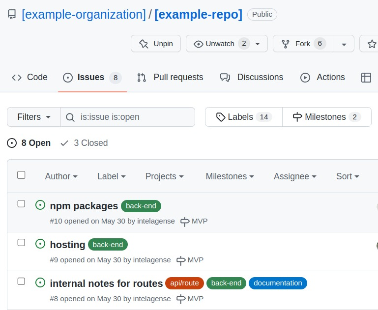
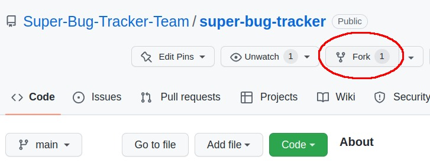
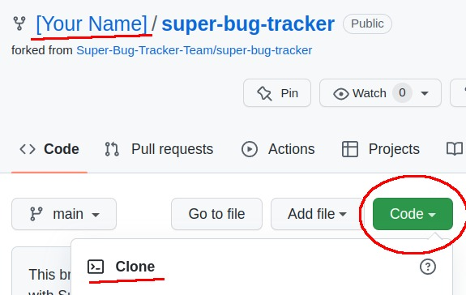
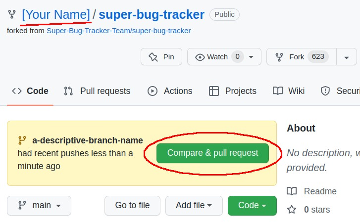
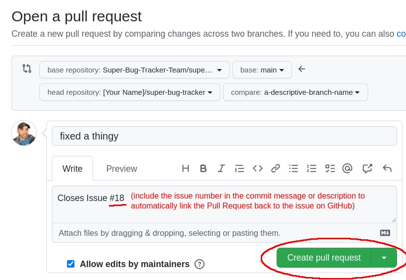

# How to contribute

Instruction steps for contributors and team members working on the project.

# Issues

An example issues tab with issues as goals.

Project goals and progress points will be split into separate issues. Team members will be able to self-assign or request assignment for each issue they wish to work on. Team members are encouraged to select issues that will give them a moderate challenge.

Issues should also be created for any bugs discovered in the project. (Very minor fixes and typos do not require an issue and can but corrected directly in a pull request with a detailed description.)

# Editing code and submitting a pull request

After selecting your first issue use the following process to make your changes.

## Forking, cloning, editing, pushing. 

1. Create a fork of the repo at https://github.com/Super-Bug-Tracker-Team/super-bug-tracker

    

1. A fork will be created to your personal GitHub account. Clone this fork on your local machine.

    

1. Create and checkout a branch for the Issue you are working on.

    `git checkout -b a-descriptive-branch-name`

1. Make any changes and save your work then make a commit

    `git status` see what has changed

    `git add .` stage your files

    `git commit -m "fixed a thingy"` perform the commit

1. Push the changes to GitHub

    `git push -u origin a-descriptive-branch-name` pushes to the remote branch

1. Now you can go back to GitHub.com to create a pull request.

## Pull requests

1. Visit your fork on GitHub and a new button should appear allowing you to create the pull request

    

1. Write a description that mentions the issue number then click "Create pull request"

    

## Merging pull requests

## Syncing your fork